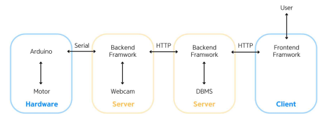
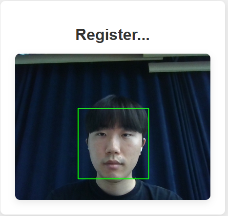
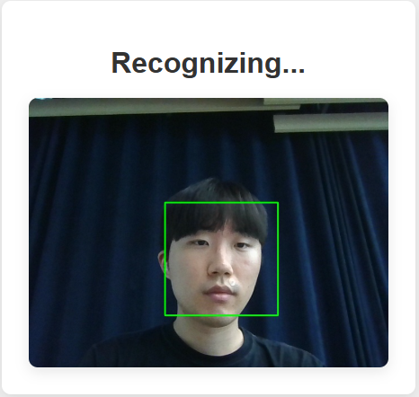

# GoH

GoH는 얼굴 인식 기반 사용자 인증, OTP 생성 로직, 금고 잠금장치 제어까지 보안성과 편의성을 동시에 강화한 IoT 융합형 인증 시스템입니다.

---

## 주요 기능

- **얼굴 인식 기반 사용자 인증**
  - Flask 서버를 통해 OpenCV LBPH 알고리즘 기반 얼굴 인식 구현
  - detectMultiScale()와 HaarCascade로 얼굴 감지
  - 감지된 얼굴 50장으로 학습 및 분류기 생성
  - 얼굴 인식 학습 데이터와 사용자 정보 연동

- **OTP 기반 2차 인증**
  - SHA-256 해시 알고리즘으로 고유 OTP 코드 생성
  - SMTP 기반 이메일 전송으로 OTP 전달
  - OTP 생성 및 검증 로직 설계

- **금고 잠금장치 제어**
  - 인증 완료 후 Arduino로 Serial 신호 전송
  - DC 모터를 이용한 물리적 잠금장치 개폐
  - 안전하고 편리한 IoT 기반 잠금 시스템 구현

- **보안 강화**
  - AES256 대칭키 암호화를 통한 사용자 민감 정보 보호
  - MySQL DB에 사용자 고유 식별자, 이메일, 비밀번호, 등록일 등 안전하게 저장

---

## 사용 기술

- **Frontend:** HTML, CSS, JavaScript  
- **Backend:** Spring Boot, Flask  
- **Database:** MySQL  
- **Embedded Platform:** Arduino UNO  

---

## 시스템 구조

1. **Spring Boot 백엔드**
   - 사용자 로그인, 회원가입, 권한 인증 등 RESTful API 구축
   - AES256 암호화를 통한 민감 정보 안전 저장
   - MySQL DB와 연동하여 사용자 정보 관리

2. **Flask 얼굴 인식 서버**
   - 얼굴 감지 및 학습, OTP 발급 전용 서버
   - OpenCV 기반 LBPH 알고리즘 활용
   - 얼굴 학습 데이터와 사용자 정보 관리

3. **OTP 생성 및 검증**
   - SHA-256 해시 기반 고유 OTP 생성
   - 이메일 전송으로 2차 인증 수행

4. **Arduino 금고 제어**
   - 인증 완료 시 서버에서 Serial 통신으로 Arduino 신호 전송
   - DC 모터로 물리적 잠금장치 개폐

---

## 화면 및 구성도

**시스템 구성도**  

**얼굴 등록 화면**  

**얼굴 인증 화면**  

**OTP 인증 화면**  

---

## 시스템 시연 영상

[GoH 시스템 시연 영상](https://youtu.be/0aTl4sEUc6I?si=jCzvcik6S-iCKFqC)

---

## 기대 효과

- 얼굴 인식과 OTP 기반 2단계 인증으로 보안성 강화  
- IoT 기반 금고 잠금으로 편의성 향상  
- 민감 정보 암호화 및 안전한 DB 관리로 사용자 데이터 보호
